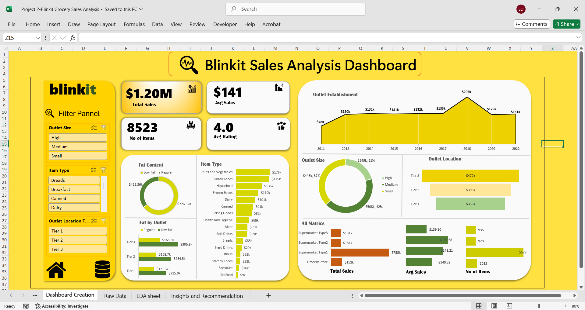

# Blinkit Grocery Sales Analysis Dashboard

### Project Overview
This project provides a detailed **sales analysis of Blinkit (Grocery Data)** using Excel.  
The goal was to identify key sales trends, customer preferences, and outlet performance through **Exploratory Data Analysis (EDA)** and an interactive **Excel Dashboard**.

---

### 🧩 Dataset Information
- **Rows:** 8524  
- **Columns:** 12  
- **Source:** Blinkit Grocery Sales Data --From Kaggle

| Column Name | Description |
|--------------|-------------|
| Item Identifier | Unique ID for each item |
| Item Weight | Weight of the product |
| Item Fat Content | Whether the product is Low Fat or Regular |
| Item Type | Category of the product (Fruits, Dairy, etc.) |
| Outlet Identifier | Unique code for each outlet |
| Outlet Establishment Year | Year when outlet was established |
| Outlet Size | Size of the outlet (Small, Medium, High) |
| Outlet Location Type | Location category (Tier 1, 2, 3) |
| Outlet Type | Type of store (Supermarket, Grocery Store, etc.) |
| Sales | Total sales amount |
| Rating | Customer satisfaction rating |

---

### ⚙️ Tools Used
- **Microsoft Excel**
  - Data Cleaning  
  - Pivot Tables  
  - Charts & Visualizations  
  - Dashboard Design  
- **EDA Techniques** (for data understanding & summary creation)

--- 

## Dashboard Preview

---

## Key Insights & Report
Download the full report here: [Blinkit Sales Analysis Final Report](./4_Final_Report.docx)

---

## How to Use
Download the Excel workbook here: [Main Project Workbook](./2_Main_Project_Workbook.xlsx)

**Steps to use:**
1. Download the workbook from the above link.
2. Open it in Microsoft Excel .
3. Explore the **Raw Data** sheet first to understand the dataset.
4. View the **Dashboard** sheet for visual representation of key metrics.
5. Use slicers to explore data  

---

### 👨‍💻 Author
**Name:** Shivank Dixit  
📧 [shivankdixit730@gmail.com]  
🔗 [LinkedIn Profile](https://www.linkedin.com/in/shivank-dixit-b61a3623b)

---
⭐ *If you found this project helpful, don’t forget to star the repository!* ⭐
